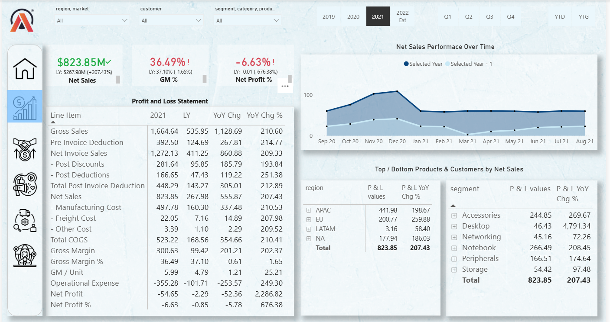
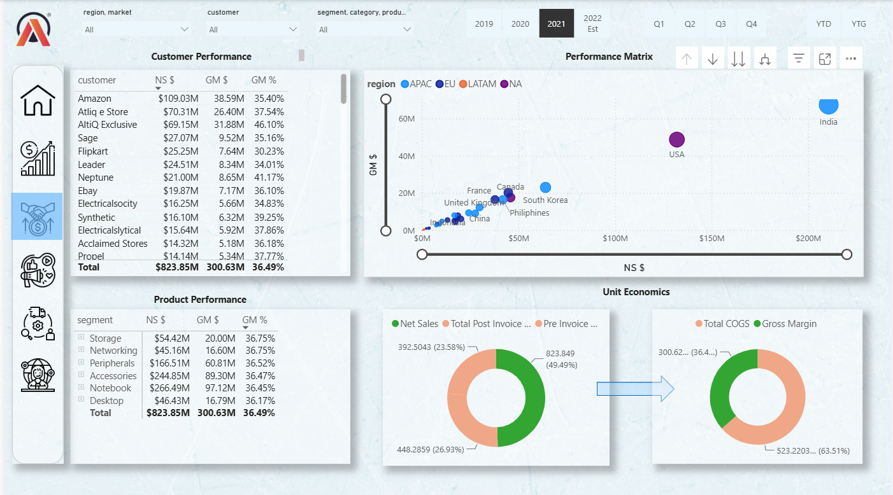
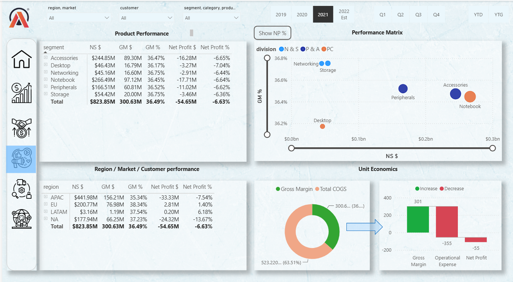

# PowerBI_dashboard_BI360

- Brick & mortar and e-commerce [Power BI | SQL | Excel | Dax Studio]

  >	Designed a multi-view dashboard in Power BI for 6 departments (sales, finance, supply chain, executive, marketing, and products) of
  AtliQ hardware to understand sales trends and facilitate data-driven decisions, which aimed to scale the business processes by 10%.
  
  >	Imported 2 different data sources (MySQL, and Excel) with more than 1 million records and performed data modeling.
   
  >	Optimized the report using DAX studio, which saved 30% of storage and improved performance by 10%

# Financial Performance Dashboard

Interactive Power BI dashboard for analyzing Net Sales, Profitability, and P&L metrics across regions, segments, and time periods with YoY comparisons.

## 📊 Finance view

## 🎯 Key Features
- **Dynamic Year Selector**: Switch between 2019, 2020, 2021, 2022 Est to update all KPIs and charts
- **Executive KPI Cards**: Net Sales $823.85M, GM % 36.49%, Net Profit % -6.63% with YoY variance vs LY
- **P&L Statement Table**: Complete line-item breakdown: Gross Sales, COGS, Gross Margin, OpEx, Net Profit with YoY Chg and YoY Chg %
- **Net Sales Performance Trend**: Month-over-month comparison of Selected Year vs Previous Year from Sep 2020 to Aug 2021
- **Regional Analysis**: Net Sales and YoY growth by region - APAC, EU, LATAM, NA
- **Segment Performance**: Top/Bottom products by segment - Accessories, Desktop, Networking, Notebook, Peripherals, Storage
- **Global Filters**: Region, Market, Customer, Segment, Category, Product slicers for drilled-down analysis
- **Quarter Filters**: Q1, Q2, Q3, Q4, YTD views

## 🛠️ Tech Stack
- **Tool**: Microsoft Power BI Desktop
- **Techniques**: DAX Measures, Time Intelligence, Bookmarks, Drill-through, Custom Visuals, Conditional Formatting
- **Key DAX**: YoY % calculation, Selected Year logic, Dynamic titles

## 📈 Data Coverage
- **Period**: FY 2019 to 2022 Est | Monthly granularity
- **Key Metrics for 2021**: Net Sales $823.85M (+207.43% YoY), Gross Sales $1,664.64M, Total COGS $523.22M
- **Regions Covered**: APAC, EU, LATAM, NA
- **Segments**: 6 product segments tracked

## 💡 Business Impact
Enables Finance and Sales teams to:
1. Monitor top-line and bottom-line health with real-time YoY comparisons
2. Identify underperforming regions and product segments quickly
3. Analyze P&L drivers: Manufacturing Cost, Freight, OpEx impact on Net Profit
4. Track sales momentum with Selected Year vs Previous Year trend overlay
5. Make data-driven decisions using filtered views by customer, market, product

# Sales Performance Dashboard

Interactive Power BI dashboard analyzing customer profitability, regional performance, product segment margins, and unit economics with dynamic filtering.

## 📊 Sales view

## 🎯 Key Features
- **Customer Performance Table**: Rank customers by Net Sales, GM $, GM % - Amazon $109.03M, AtliQ E Store $70.31M, etc
- **Performance Matrix**: Scatter plot of GM $ vs NS $ by country, color-coded by region: APAC, EU, LATAM, NA
- **Product Performance Table**: Segment-wise breakdown - Accessories $244.85M, Notebook $266.49M, Peripherals $166.51M with GM %
- **Unit Economics Donuts**: Visual breakdown of Net Sales to Gross Margin - Pre Invoice Deduction, Post Invoice Deduction, COGS flow
- **Global Filters**: Region, Market, Customer, Segment, Category, Product + Year and Quarter slicers
- **Cross-filtering**: Click any customer, segment, or country to filter entire dashboard instantly

## 🛠️ Tech Stack
- **Tool**: Microsoft Power BI Desktop  
- **Techniques**: DAX Measures, Scatter Charts, Donut Charts, Matrix Visuals, Drill-through, Tooltips, Conditional Formatting
- **Key DAX**: GM %, Contribution Margin, Rank customers by NS, Dynamic segmentation

## 📈 Data Coverage
- **Period**: FY 2019 to 2022 Est | Filterable by Year and Quarter
- **Key Metrics for 2021**: Total NS $823.85M, Total GM $300.63M, Overall GM % 36.49%
- **Top Customer**: Amazon - NS $109.03M, GM $38.59M, GM % 35.40%
- **Top Segment**: Notebook - NS $266.49M, GM $97.12M, GM % 36.45%

## 💡 Business Impact
Enables Sales and Marketing teams to:
1. Identify most profitable customers and prioritize account management efforts
2. Spot underperforming regions/countries using Performance Matrix quadrant analysis
3. Compare product segment margins to guide portfolio strategy
4. Understand unit economics: how Gross Sales $1,664M converts to Net Sales $823M to GM $300M
5. Drive targeted campaigns by filtering high GM% customers in low NS regions

 # Marketing Dashboard 

Interactive Power BI dashboard for deep-dive analysis of Net Profit %, Gross Margin, and Unit Economics across product segments, divisions, and regions to identify loss-making areas.

## 📊 Market view

## 🎯 Key Features
- **Product Performance Table**: Segment-wise NS $, GM $, GM %, Net Profit $, Net Profit % - all 6 segments showing negative Net Profit % for 2021
- **Performance Matrix by Division**: Scatter plot of GM % vs NS $ for N&S, P&A, PC divisions. Bubble size shows contribution. Toggle `Show NP %` view
- **Region/Market/Customer Performance**: P&L breakdown by region - APAC -$33.33M, NA -$24.32M, EU +$2.81M, LATAM +$0.20M Net Profit
- **Unit Economics Waterfall**: Visual flow from Gross Margin $300.6M → Operational Expense -$355M → Net Profit -$54.65M
- **COGS vs GM Donut**: Shows 63.51% COGS vs 36.49% Gross Margin split of Net Sales
- **Global Filters**: Year, Quarter, Region, Market, Customer, Segment, Category, Product slicers

## 🛠️ Tech Stack
- **Tool**: Microsoft Power BI Desktop
- **Techniques**: DAX Measures, Waterfall Charts, Scatter Plots, Matrix Visuals, Conditional Formatting, What-if Parameters
- **Key DAX**: Net Profit %, GM %, Variance to Target, Division mapping logic

## 📈 Data Coverage
- **Period**: FY 2019 to 2022 Est | 2021 selected
- **Key Metrics for 2021**: NS $823.85M, GM $300.63M (36.49%), Net Profit -$54.65M (-6.63%)
- **Worst Performing Segment**: Notebook -$17.71M Net Profit, -6.64% NP %
- **Worst Performing Region**: APAC -$33.33M Net Profit, -7.54% NP %
- **Only Profitable Regions**: EU +1.40%, LATAM +6.18% NP %

## 💡 Business Impact
Enables Finance and Executive teams to:
1. Pinpoint loss-making segments and regions driving overall -6.63% Net Profit
2. Compare divisions N&S, P&A, PC on profitability vs scale using Performance Matrix
3. Diagnose unit economics: Strong GM 36.49% eroded by high OpEx leading to negative NP
4. Prioritize turnaround actions for Notebook segment -$17.71M and APAC region -$33.33M
5. Track profitability recovery with Year/Quarter filters and NP % toggle

- By doing this project I acquired technical skills are as mentioned below:

  
 Power BI Desktop

  >	Data Import and Connection

  >	Data Visualization, Report Building, Dashboard Creation

  >	Using KPI indicators

  >	Conditional Formatting

  >	Bookmarks (Used to switch between two visuals)

  >	Page navigation with buttons

  >	Tooltips

	Power Query

>	Handling errors and data cleansing techniques

>	Append Query

>	Merge Query

>	Custom Column

>	Creating date table using m language

	DAX Language

>	Defining Calculated Column and measures using the DAX

>	Dynamic titles based on the applied filters

>	Used DAX functions like: Aggregate, Text, Conditional, Time Intelligence, Statistical, Mathematical, Date and Time functions.

>	Data Modeling

>	Creating Relationship between different tables

>	Star Schema and Snowflake Schema

	DAX Studio (for report optimization)

	Power BI services

	Publishing reports to Power BI services

	Setting up the personal gateway to set up the auto-refresh of data

